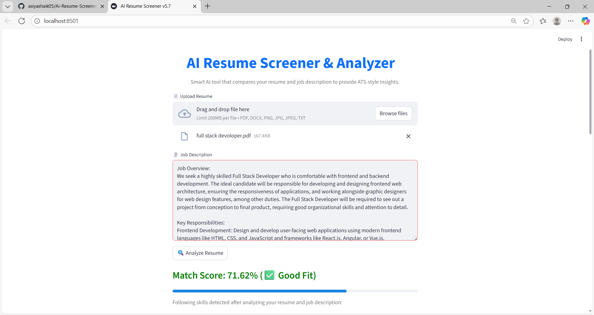
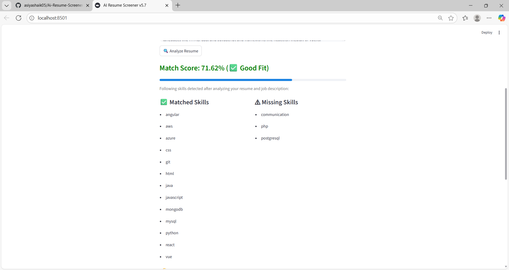
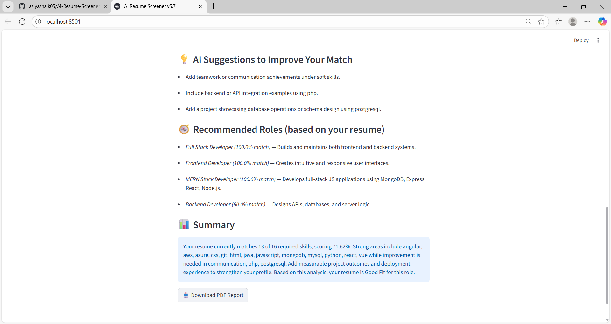
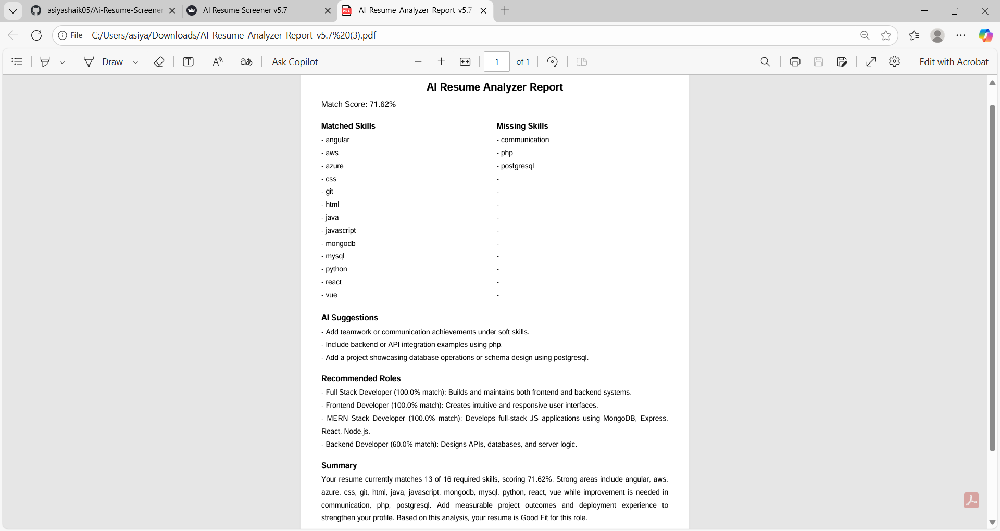

# 🧠 AI Resume Screener & Analyzer v5.7

An AI-powered Streamlit app that analyzes resumes and job descriptions to provide:
- ✅ ATS-style match score
- 💡 Smart AI improvement suggestions
- 🧭 Recommended roles
- 📊 PDF analysis report

- ## ✨ Features

- Upload your resume (PDF, DOCX, PNG, JPG, TXT)  
- Paste any Job Description  
- AI analyzes skills match, missing skills, and provides improvement suggestions  
- Generates a *PDF report* of the analysis  
- Suggests suitable roles based on detected skills

- ## Install dependencies:
- pip install -r requirements.txt

- ## Run the Streamlit app:
streamlit run app.py 

## 🗂️ Project Structure
AI-Resume-Screener/
├── app.py
├── requirements.txt
├── README.md
├── home.png
├── result.png
├── suggestions.png
└── report.png

## Limitations
The AI only detects skills listed in the predefined skill dictionary. Skills not included may not be recognized.
Resume formatting issues (complex tables, images, or unusual fonts) may affect text extraction accuracy.
The semantic similarity score is approximate and may not perfectly reflect real-world match.
Currently supports only English resumes and job descriptions.
Cloud deployment (Streamlit Cloud) may have file size limits for uploaded resumes.
Does not automatically handle resume updates or multiple resume versions — analysis is per uploaded file.

## ⚖️ License

This project is open-source and free to use.
## 🖼️ App Preview

